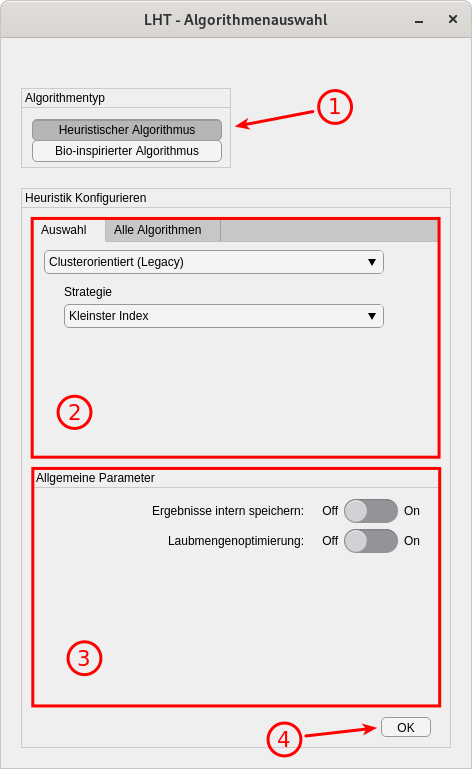

.. _gui-algorithmen:

GUI zum Erzeugen von Algorithmen
================================

.. contents::
   :local:

Das GUI zum Erzeugen von Algorithmen ist im Wesentlichen ein Wrapper um die
Kindklassen von |bw|. Es stellt über diese Klassen hinaus keine weiteren
Features bereit.
Die folgenden Abbildungen :numref:`{number} <A1>` und :numref:`{number} <A2>`
zeigen das GUI jeweils zum Konfigurieren deterministischer und bio-inspirierter
Algorithmen. Um die Codeduplizierung zu minimieren, ist die Konfiguration
beider Algorithmentypen in ein einziges GUI kombiniert worden.

Aufruf des GUI
--------------

Das GUI zum Erzeugen der Algorithmen befindet sich im Modul
:mod:`+lhp.+gui.Algorithmen`. Am einfachsten wird das GUI direkt über das Matlab-Command-Window aufgerufen:

.. code:: matlab

   lhp.gui.Algorithm

Allerdings gilt es zu beachten, dass auf diese Weise kein Algorithmus erzeugt
wird: Ein Druck auf den ,,OK''-Knopf übergibt den erzeugten Algorithmus an die
Methode ``disp()``, welche den Algorithmus in textueller Form im Command-Window
ausgibt.

Um dieses Verhalten zu modifizieren, gibt es den ``'Callback'``-Parameter, der
beim Aufruf des GUI spezifiziert werden kann. Bei dem Callback handelt es sich
um ein ``function_handle``, also um einen Funktionspointer, der beim Bestätigen
eines Algorithmus mit dem erzeugten Objekt dieses Algorithmus aufgerufen wird.
Der übergebene Callback akzeptiert daher exakt ein Funktionsargument.

**Um auf diese Weise den erzeugten Algorithmus einer Variablen im
base-Workspace zuzuweisen, wird folgender Aufruf benötigt**

.. code:: matlab

   lhp.gui.Algorithm("Callback", @(alg) assignin('base', 'Algorithmus', alg));

Dieser Aufruf weist den erzeugten Algorithmus einer Variablen ``Algorithmus``
im Matlab base-Workspace zu.

.. note::

   An dieser Stelle mag man sich fragen, weshalb es sich hierbei nicht um das
   "Standardverhalten" des GUI handelt, wenn man es ohne weitere Parameter
   aufruft. Hierfür gibt es zwei Gründe:
   
   1. Das versehentliche Überschreiben bereits existierender Variablen soll
      vermieden werden.
   2. Wenn man im Command-Window arbeitet (von wo man das GUI wahrscheinlich
      aufruft), bietet sich die direkte Konfiguration der Algorithmen über
      die |bw|-Kindklassen an.

Deterministische Heuristiken
----------------------------

.. _A1:

   GUI zum Konfigurieren deterministisch-heuristischer Algorithmen.

Das GUI ist in 4 Kernbereiche (*Panele*) aufgeteilt, wie in Abbildung 
:numref:`%s <A1>` markiert.

Im ersten Panel wird über zwei Knöpfe der Algorithmentyp ausgewählt. In
Abbildung :numref:`%s <A1>` ist die Konfiguration der deterministischen
Heuristiken (|dw|) gezeigt. Die Konfiguration bio-inspirierter Algorithmen ist
in Abbildung :numref:`%s <A2>` gezeigt.

Das zweite Panel dient zur Auswahl der konkreten Heuristik, die erzeugt werden
soll. Der Nutzer hat über die Tabs zwei verschiedene Interfaces zur Auswahl:

Tab *Auswahl*
    Hier werden die deterministischen Heuristiken nach den übergeordneten
    Algorithmenklassen konfiguriert. Zum aktuellen Zeitpunkt existieren 3
    Algorithmenklassen: 
    
    1. Zickzack (|zz|),
    2. Sukzessive Clusterverfahren (|SucC|),
    3. Simultane Clusterverfahren (|SimC|)

    Jede der Algorithmenklassen hat Ihrerseits verschiedene Parameter zur
    weiteren Defintion des Verhaltens. Diese werden dem Nutzer als Drop-Down-Menüs
    präsentiert, nachdem eine Algorithmenklasse ausgewählt worden ist. In
    Abbildung :numref:`%s <A1>` sieht man, dass die Clusterorientierten
    Verfahren einen Parameter "Strategie" erwarten, der mehrere Optionen bereit
    stellt.

Tab *Alle Algorithmen*
    In diesem Tab (Nicht in Abbildung :numref:`%s <A1>` gezeigt) wird dem Nutzer
    ein Suchfeld, zusammen mit einer Liste **aller** deterministischen
    Heuristiken präsentiert. Die Algorithmen sind nach einem festen
    Namensschema benannt, das in erster Linie der algorithmischen
    Unterscheidbarkeit und nicht der direkten Lesbarkeit dient.

    Über das Suchfeld können die anzuzeigenden Algorithmen gefiltert werden,
    indem der Nutzer die Anfangsbuchstaben der Algorithmen eintippt, die er
    sehen möchte. **Diese Art des Zugriffs ist insbesondere für erfahrene
    Benutzer gedacht, die den Bezeichner des gewünschten Algorithmen bereits
    kennen**.

.. note::    

   Um die Suche durchzuführen, muss nach der Eingabe eines Textes 'Tab'
   gedrückt oder mit der Maus irgendwo anders in das Fenster geklickt werden.
   Hierbei handelt es sich um eine ,,Limitierung'' seitens Matlab, die
   programmiertechnisch nicht elegant zu lösen ist.

Im dritten Panel lassen sich Parameter einstellen, die für alle Algorithmen
eines Typs gleichermaßen gültig sind. Aus Sicht des Programmcodes sind dies
die Konstruktorparameter für |dw|.
Es empfiehlt sich, bei der Verwendung der Algorithmen im Zusammenhang mit dem
|tm|, die interne Speicherung der Ergebnisse zu deaktivieren.

Zuletzt kann mit dem Knopf unter (4) die Konfiguration des Algorithmus
bestätigt werden. Was genau mit dem erzeugten Algorithmus passiert, hängt davon
ab, welche Parameter dem GUI beim Aufruf übergeben wurden. Wurde das GUI durch
das Betätigen eines Knopfes in einem anderen GUI geöffnet, ist vom Nutzer
nichts weiter zu tun, da die GUIs untereinander korrekt kommunizieren.

Bio-inspirierte Algorithmen
---------------------------

.. _A2:

   GUI zum Konfigurieren bio-inspirierter Algorithmen

Die Ansicht ist auch hier in 4 Panele aufgeteilt, die die gleiche Aufgabe
erfüllen wie bei der Konfiguration der Heuristiken (Abbildung :numref:`%s
<A1>`). Daher ist die folgende Beschreibung auf die wesentlichen Unterschiede
beschränkt.

Im zweiten Panel wird der konkrete bio-inspirierte Algorithmus ausgewählt, der
verwendet werden soll. Zum aktuellen Zeitpunkt sind das der genetische und der
Bienenalgorithmus. Die Parameter zu den jeweiligen Algorithmen werden als Teil
von |pdata| verwaltet und sind nicht den Algorithmen zugeordnet.

.. note::
   Es besteht allerdings der Wunsch, diese Zuordnung zu ändern, sprich: Die
   Parameter für die jeweiligen bio-inspirierten Algorithmen sollen als Teil
   von |sw| verwaltet werden und nicht in den Problemstellungen.

Im dritten Panel lassen sich Parameter einstellen, die für alle
bio-inspirierten Algorithmen gleichermaßen gültig sind. Aus Sicht des
Programmcodes sind dies die Konstruktorparameter für |sw|.
Es empfiehlt sich, bei der Verwendung der Algorithmen im Zusammenhang mit dem
|tm|, die interne Speicherung der Ergebnisse zu deaktivieren.

Die Funktion des Knopfes (4) ist dieselbe wie oben beschrieben.

.. include:: ../replacements.rst

