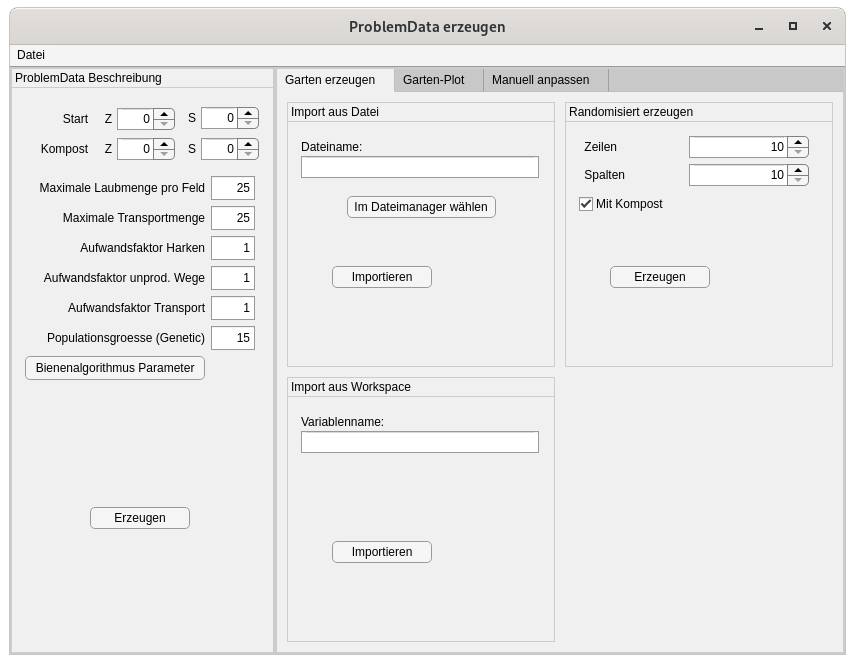
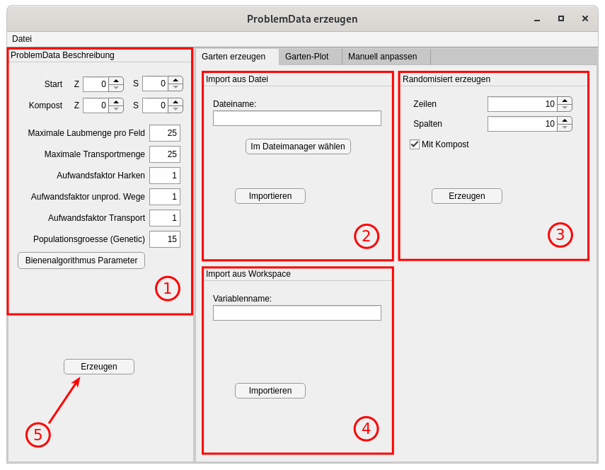
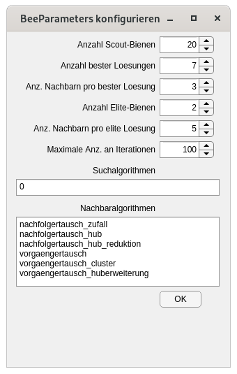
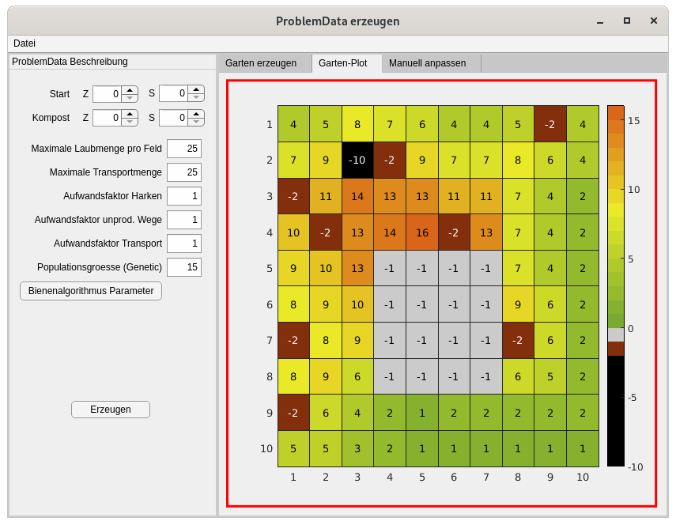
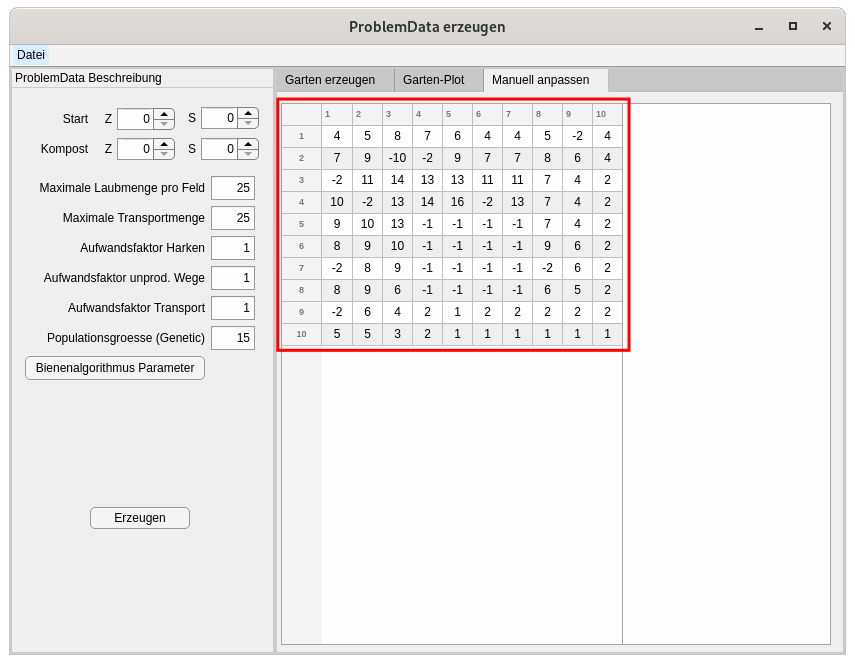

.. _gui-pdata:

GUI zum Erzeugen von |pdata|-Objekten
=====================================

.. contents::
   :local:

   Ansicht des GUI nach dem Öffnen.

Das GUI zum Erzeugen von |pdata|-Objekten ist ein Wrapper um die |pdata|-Klasse, sowie die Funktion |zg| zum Erzeugen von zufälligen Gärten.

Es besteht im Wesentlichen aus 3 Tabs, in denen ein Garten erstellt werden
kann, sowie einem links angeordneten Panel, in dem sonstige Problemparameter
konfiguriert werden. Diese einzelnen Bestandteile werden im Folgenden erläutert.

Aufruf des GUI
--------------

Das GUI zum Erzeugen von |pdata|-Objekten befindet sich im Modul
:mod:`+lhp.+gui.ProblemData`. Am einfachsten wird das GUI direkt über das Matlab-Command-Window aufgerufen:

.. code:: matlab

   lhp.gui.ProblemData();

Im GUI gibt es diverse Möglichkeiten, bereits erzeugte ,,Probleme'' zu
importieren. Es ist aber auch möglich, das GUI bereits beim Aufruf mit den
Werten aus einem existierenden |pdata|-Objekt zu initialisieren:

.. code:: matlab

   % pdata muss ein Objekt vom Typ 'ProblemData' sein!
   lhp.gui.ProblemData("ProblemData", pdata);

Es gilt zu beachten, dass bei diesem Aufruf kein gültiges Problem
erzeugt wird: Ein Druck auf den ,,Erzeugen''-Knopf übergibt das erzeugte
|pdata|-Objekt an die Methode ``disp()``, die das Objekt in textueller Form
im Command-Window ausgibt.

Um dieses Verhalten zu modifizieren, gibt es den ``'Callback'``-Parameter, der
beim Aufruf des GUI spezifiziert werden kann. Bei dem Callback handelt es sich
um ein ``function_handle``, also um einen Funktionspointer, der beim
Bestätigen eines |pdata|-Objektes mit dem erzeugten Objekt aufgerufen wird.
Der übergebene Callback akzeptiert daher exakt ein Funktionsargument.

**Um auf diese Weise das erzeugte |pdata|-Objekt einer Variablen im
base-Workspace zuzuweisen, wird folgender Aufruf benötigt**

.. code:: matlab

   lhp.gui.ProblemData("Callback", @(pdata) assignin('base', 'Problem', pdata));

Dieser Aufruf weist das erzeugte Problem einer Variablen ``Problem``
im Matlab-base-Workspace zu.

.. note::

   An dieser Stelle mag man sich fragen, weshalb es sich hierbei nicht um das
   "Standardverhalten" des GUI handelt, wenn man es ohne weitere Parameter
   aufruft. Hierfür gibt es zwei Gründe:
   
   1. Das versehentliche Überschreiben bereits existierender Variablen soll
      vermieden werden.
   2. Wenn man im Command-Window arbeitet (von wo man das GUI wahrscheinlich
      aufruft), bietet sich die direkte Konfiguration der Algorithmen über
      die |pdata| Klasse an.

Hauptansicht des GUI
--------------------

.. _P1:

   Ansicht des GUI nach dem Öffnen.

In Abbildung :numref:`%s <P1>` ist die Hauptansicht des GUI unmittelbar nach dem
Öffnen dargestellt. Es zeigt das Seitenpanel links, die Menüleiste oben (im
Bild nicht markiert), sowie die Ansicht des ersten der 3 Panele.

Markiert mit den Nummern 1 bis 4 sind verschiedene Panele, deren Funktion im
Folgenden erläutert wird:

Das erste Panel dient zur Konfiguration der Problemparameter. Das umfasst:

- Die Position des Start- und Kompostknotens
- Die Kosten für das Gehen, Harken und Abtransportieren von Laub
- Die maximale Laubmenge, die aufgehäuft werden kann
- Die maximale Laubmenge, die in der Schubkarre auf einmal abtransportiert
  werden kann.

Hierbei sollte man berücksichtigen, dass zumindest die explizite
Konfiguration eines Start- und Kompostknotens erst dann sinnvoll ist, wenn
bereits ein Garten erzeugt wurde, da man die Knoten nicht blind setzen kann.

.. note::

   Wird die Voreinstellung von Start und Kompost bei ``0, 0`` gelassen, wird die
   Position beim Erzeugen des |pdata|-Objektes (Schaltfläche 5) zufällig im
   Garten ausgewählt. Das ist dann nützlich, wenn die genaue Positionierung der
   Knoten keine große Rolle spielt.

   **Ausnahme beim Kompost:** Ist im erzeugten Garten bereits ein Feld mit dem
   Wert :math:`-10`, wird die Koordinate dieses Feldes als Kompoststelle
   übernommen!

Sollte hingegen bereits ein Garten mit Kompost vorhanden sein, und der Nutzer
will den Kompost verschieben, muss er zuvor den bestehenden Kompost
entfernen. Wie das geht, ist im Text unter Abbildung :numref:`%s <P4>` beschrieben.

Hinter der Schaltfläche ,,Bienenalgorithmus Parameter'' verbirgt sich ein
weiteres GUI, das in Abbildung :numref:`%s <P2>` dargestellt ist.

.. _P2:

   GUI zur Konfiguration der Parameter für den Bienenalgorithmus.

In diesem Fenster werden Parameter für den Bienenalgorithmus definiert. Da
die Parameter sehr algorithmenspezifisch sind, wird auf eine genauere
Erläuterung verzichtet. Alle Schalt- und Bedienflächen in dem GUI sind mit
Tooltips versehen, die beim längeren Verweilen mit der Maus Informationen
darüber geben, welche Parameter gültig sind.
Darüber hinaus kann, wie immer, die Matlab Hilfe zu Rate gezogen werden.

Die Panele 2 bis 4 in Abbildung :numref:`%s <P1>` verfolgen alle denselben
Zweck: Die Bereitstellung eines Gartens. Der Nutzer hat somit drei
verschiedene Möglichkeiten, einen Garten zu konfigurieren:

1. Der Garten kann aus einer ``.mat``, ``.xls(x)`` oder ``.csv`` Datei
   eingelesen werden (Panel 2)
2. Der Garten kann randomisiert erzeugt werden (Panel 3)
3. Der Garten kann aus einer Variablen im base-Workspace eingelesen werden
   (Panel 4)

In jedem Fall ist der erzeugte Garten hinterher im Tab *Garten-Plot*
(Abbildung :numref:`%s <P3>`) zu sehen.

Zuletzt erzeugt der Knopf mit der Nummer 5 in Abbildung :numref:`%s <P1>` das
konfigurierte |pdata|-Objekt.

Inspektion des erzeugten Gartens
--------------------------------

.. _P3:

   Grafische Ansicht des erzeugten Gartens

Im zweiten Tab des GUI, dargestellt in Abbildung :numref:`%s <P3>`, ist der
erzeugte Garten grafisch dargestellt. Anhand der farblichen Unterscheidung
der Felder des Gartens im Zusammenhang mit der Farbleiste kann der Nutzer
direkt erahnen, welche Bedeutung die einzelnen Gartenfelder haben:

- Ein Wert von :math:`-10` markiert den Kompost (schwarz)
- Ein Wert von :math:`-2` markiert Bäume im Garten (braun)
- Ein Wert von :math:`-1` markiert den Gartenschuppen (grau)
- Ein Wert von :math:`0` zeigt Felder ohne Laub (grün)
- Größere Werte werden von lindgrün über gelb zunehmend dunkler

Der Gedanke hinter dieser Farbgebung ist, dass auf Felder ohne Laub der
(hoffentlich) grüne Rasen zu sehen ist. Je mehr Laub sich auf einem Feld
sammelt, umso mehr nimmt es eine orange Färbung an.

Grundsätzlich können weitere Feldtypen mit negativen Zahlenwerten und einer zugehörigen Einfärbung definiert werden.

Modifikation des erzeugten Gartens
----------------------------------

.. _P4:

   Tabellarische Darstellung des Gartens

Im dritten Tab des GUI ist derselbe Garten wie im zweiten Tab (Abbildung
:numref:`%s <P3>`) dargestellt, allerdings in Tabellenform. In dieser Ansicht
können die Werte einzelner Felder des Gartens händisch angepasst werden. Das
kann dann sinnvoll sein, wenn eine bestimmte Gartentopologie erzwungen werden
soll. Unter anderem wenn der Kompost an eine andere Stelle verschoben werden
soll, ist eine händische Manipulation des Gartens unerlässlich. Es ist
nämlich nicht erlaubt, mehr als eine Kompoststelle im Garten zu haben!

Zum Ändern eines Wertes wird die entsprechende Zelle doppelt angeklickt.
Daraufhin kann ein neuer Zahlenwert eingetragen werden. Bestätigt wird die
Eingabe mit ``Enter``, oder durch einen Klick an eine andere Stelle des GUI.
Die Ansicht im zweiten Tab (Abbildung :numref:`%s <P3>`) aktualisiert sich dann
automatisch.

Import und Export
-----------------

Zuletzt ist noch die Bedeutung der Menüleiste am oberen Fensterrand in
Abbildung :numref:`%s <P1>` zu erläutern. Durch einen Klick auf ,,Datei'' öffnet
sich ein Menü, in dem zwischen ,,Import'' und ,,Export'' ausgewählt werden
kann.

Mit Hilfe dieses Menüs ist es möglich:

1. Erzeugte Probleme zu exportieren (Menüpunkt ,,Export'')

   1. Als Variable in den Workspace (,,In den Workspace''), wobei der Name
      der zu erzeugenden Variablen dann vom Nutzer abgefragt wird.
   2. In eine ``.mat``-Datei auf dem Rechner (,,In eine Datei'')

2. Zu modifizierende Probleme zu importieren (Menüpunkt ,,Import'')

   1. Aus einer Variablen im Workspace (,,Aus dem Workspace''), wobei der Name
      der zu importierenden Variablen dann vom Nutzer abgefragt wird.
   2. Aus einer ``.mat``-Datei auf dem Rechner (,,Aus einer Datei''), in der 
      ein Objekt vom |pdata| enthalten sein muss

3. Zu modifizierende Gärten zu importieren (Menüpunkt ,,Import'')

   1. Aus einer Variablen im Workspace (siehe oben, Variablentyp muss 
      numerische Matrix sein)
   2. Aus einer Datei (siehe oben, Datei darf in diesem Fall ``.mat``, 
      ``.xls(x)`` oder ``.csv`` sein)

Das Importieren von Gärten/|pdata|-Objekten ist hier doppelt belegt. Sofern
der Nutzer eine ``.mat``-Datei importiert, in der sowohl eine Gartenmatrix,
aus auch ein |pdata|-Objekt enthalten sind, wird |pdata| bevorzugt.

.. include:: ../replacements.rst
