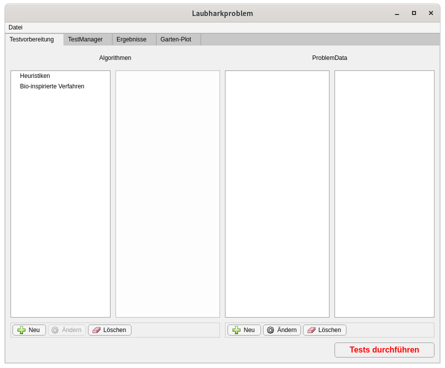
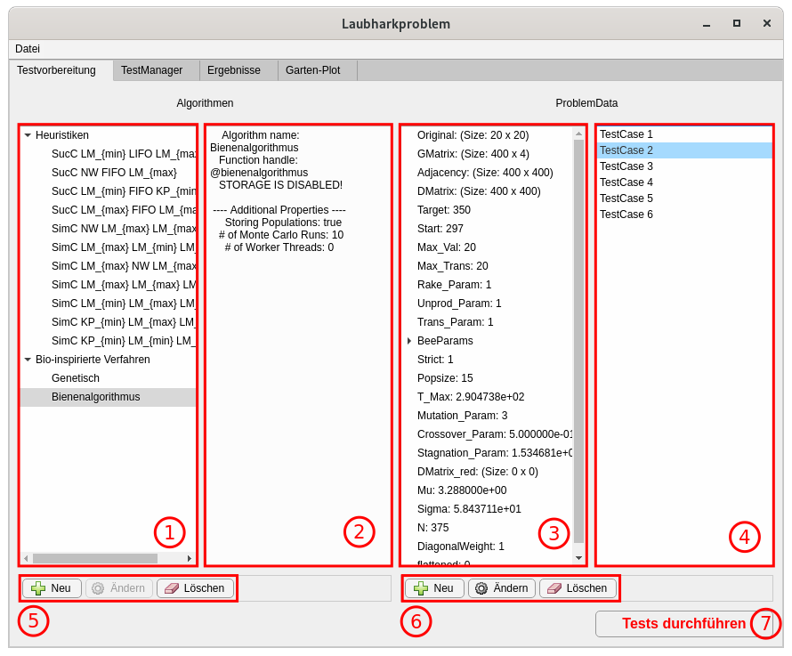
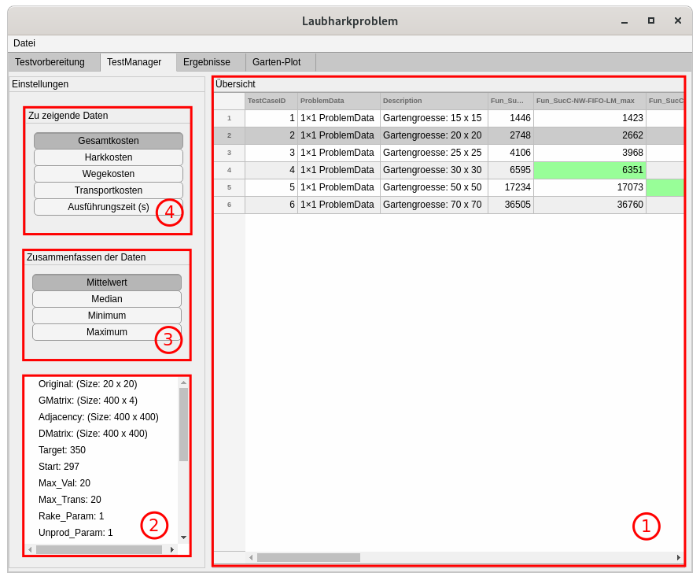
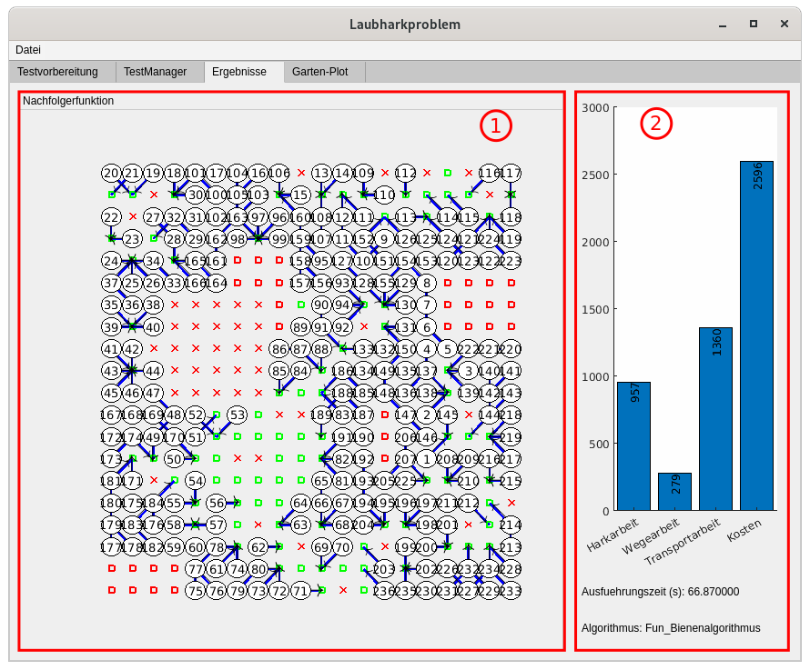
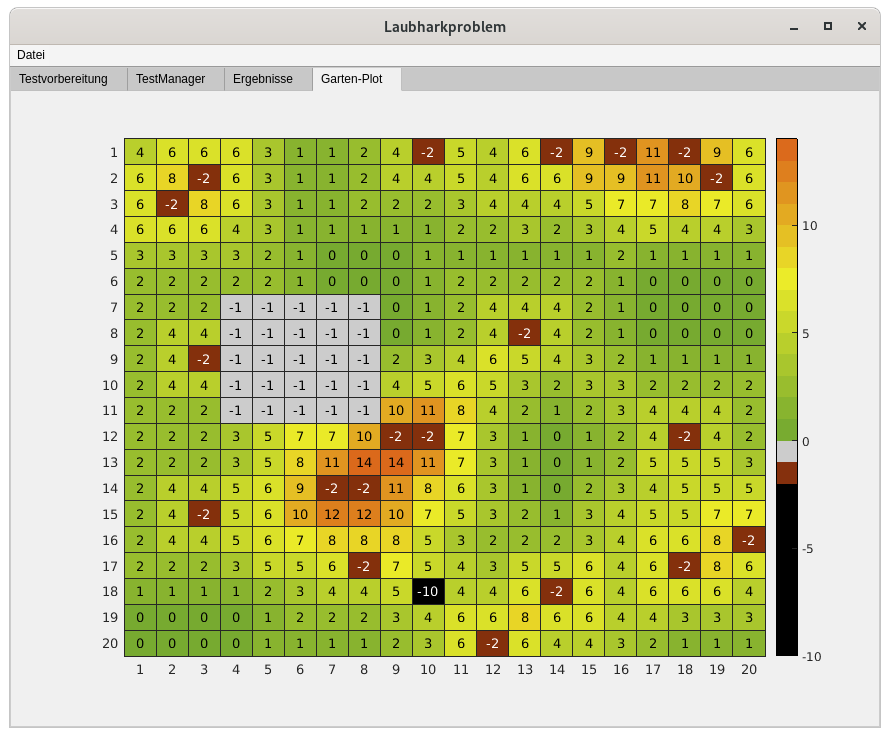

GUI zum Erzeugen und Verwalten von |tm|-Objekten
================================================

.. contents::
   :local:

   Ansicht des GUI nach dem Öffnen.

Das GUI zum Erzeugen und Verwalten von |tm|-Objekten ist ein Wrapper um die |tm|
Klasse.

Es besteht im Wesentlichen aus 4 Tabs, in denen ein |tm| erzeugt und
verwaltet und die Visualisierung von Ergebnissen ermöglicht wird.
Die einzelnen Bestandteile werden im Folgenden erläutert.

Aufruf des GUI
--------------

Das GUI zum Erzeugen von |tm|-Objekten befindet sich im Modul
:mod:`+lhp.+gui.TestManager`. Am einfachsten wird das GUI direkt über das
Matlab-Command-Window aufgerufen:

.. code:: matlab

   lhp.gui.TestManager();

Im GUI gibt es diverse Möglichkeiten, bereits erzeugte |tm| zu
importieren. Es ist aber auch möglich, das GUI bereits beim Aufruf mit den
Werten aus einem existierenden |tm|-Objekt zu initialisieren:

.. code:: matlab

   % tm muss ein Objekt vom Typ 'TestManager' sein!
   lhp.gui.TestManager(tm);

Um einen |tm| aus dem GUI abzuspeichern, wird die Menüleiste verwendet. Dies
ist weiter unten erklärt.

Hauptansicht des GUI
--------------------

.. _T1:

   Ansicht des GUI nach dem Import eines |tm|.

In Abbildung :numref:`%s <T1>` ist ein Foto des GUI gezeigt, nachdem ein bereits
vorhandener |tm| importiert wurde. Es zeigt den ersten Tab
(,,Testvorbereitung''), in dem zu testende Algorithmen und Testszenarien
verwaltet werden. Der Tab ist in mehrere Panele unterteilt.

**Panel 1, 2 und 5** dienen dem Verwalten der zu testenden Algorithmen. Über die
**Bedienelemente in Panel 5** können neue Algorithmen hinzugefügt werden (Knopf
,,Neu''), sowie bereits vorhandene, im ersten Panel ausgewählte Algorithmen
entfernt werden (Knopf ,,Löschen'').

Nach dem Hinzufügen eines neuen Algorithmus öffnet sich das
:ref:`gui-algorithmen`. Wird dort ein Algorithmus über den Knopf ,,OK''
bestätigt, taucht er automatisch in der Liste in Panel 1 auf. Die Ansicht in
diesem Panel ist so gestaltet, dass deterministische Heuristiken und
bio-inspirierte Algorithmen getrennt voneinander dargestellt werden.

.. note::

   Wird ein Algorithmus im GUI hinzugefügt, schließt sich das Fenster zum
   Konfigurieren der Algorithmen nicht von selbst. Das ist so beabsichtigt,
   weil es dem Nutzer ermöglicht, mehrere Algorithmen nacheinander zu
   konfigurieren, ohne den Dialog jedesmal von neuem zu öffnen.

Wählt der Nutzer in **Panel 1** einen Algorithmus aus, erscheint in 
**Panel 2** eine textuelle Beschreibung des Algorithmus. Diese Beschreibung
dient dem schnellen Überblick über die bereits konfigurierten Algorithmen.

**Panel 3, 4 und 6** werden zum Verwalten der durchzuführenden Testszenarien
verwendet. Über die **Bedienelemente in Panel 6** können:

- Neue Testszenarien hinzugefügt werden (Knopf ,,Neu'')
- Bestehende Testszenarien geändert werden (Knopf ,,Ändern'')
- Bestehende Testszenarien gelöscht werden (Knopf ,,Löschen''), nachdem sie
  in Panel 4 ausgewählt wurden.

.. note::

   Beim ,,Ändern'' von Testszenarien werden diese aus der Ergebnistabelle des
   |tm| gelöscht und als neuer Test (neue Zeile) in die Tabelle eingefügt.
   Aus diesem Grund bleibt die *TestCaseID* beim Ändern eines Tests nicht
   erhalten!

Ein Betätigen des Knopfes ,,Neu'' öffnet das :ref:`gui-pdata`. Wird dort ein
|pdata|-Objekt über den Knopf ,,Erzeugen'' bestätigt, taucht es in der
**Liste in Panel 4** auf.

.. note::

   Wird ein Testszenario im GUI hinzugefügt, schließt sich das Fenster zum
   Konfigurieren von |pdata| nicht von selbst. Das ist so beabsichtigt,
   weil es dem Nutzer ermöglicht, mehrere Testszenarien nacheinander zu
   konfigurieren, ohne den Dialog jedesmal von neuem zu öffnen.

Wählt der Nutzer in **Panel 4** ein Testszenario aus, erscheint in 
**Panel 3** eine textuelle Beschreibung des Szenarios. Diese Beschreibung soll
dem Nutzer einen schnellen Überblick über die bereits konfigurierten
Testszenarien bieten. Darüber hinaus wird die Gartenmatrix für den
ausgewählten Test im vierten Tab (,,Garten-Plot'') grafisch dargestellt.

Zuletzt startet **Knopf 7** die Berechnung aller noch nicht zuvor berechneten
Testszenarien mit den entsprechenden Algorithmen. Einen Überblick darüber,
welche Tests bereits durchgelaufen sind und welche nicht, bietet der zweite
Tab des GUI, zu sehen in Abbildung :numref:`%s <T2>`.

Der ,,TestManager''-Tab
-----------------------

.. _T2:

   Zweiter Tab des |tm|-GUI.

Der zweite Tab des GUI zeigt die aktuellen Ergebnisse des |tm|.

**Panel 1** zeigt die Ergebnisse in tabellarischer Form, wie sie die Methode
:func:`~+lhp.+utils.TestManager.get_results` des |tm| zurückgibt.
Diese Ansicht ist interaktiv, eine Auswahl bestimmter Objekte zieht weitere
Aktionen nach sich:

Auswahl einer Ergebnis-Zelle eines Algorithmus
   Wird ein einzelnes Ergebnis (eine Zelle) eines Algorithmus markiert, wird im
   Tab ,,Ergebnisse'' die Lösung angezeigt und der Tab ,,Garten-Plot'' zeigt
   eine grafische Darstellung des Gartens. Außerdem wird in **Panel 4** eine
   textuelle Beschreibung des gelösten Problems dargestellt.

Auswahl einer Zelle der ersten 3 Tabellenspalten
   Die ersten drei Tabellenspalten enthalten keine darstellbaren Ergebnisse.
   Eine Auswahl einer einzelnen Zelle hier hat denselben Effekt wie die
   Auswahl einer ganzen Tabellenzeile (siehe nächster Eintrag).

Auswahl einer Tabellenzeile
   Wird eine ganze Tabellenzeile ausgewählt (durch das Anklicken einer der
   fortlaufend durchnummerierten Zahlen ganz links im ersten Panel) wird
   automatisch **das beste Ergebnis** dieser Zeile ausgewählt und in den Tabs
   3 und 4 grafisch dargestellt.

Auswahl mehrerer Zellen
   Das Auswählen mehrerer Zellen hat keinen Effekt.

Auswahl einer Tabellenspalte
   Das Auswählen einer Tabellenspalte hat keinen Effekt.

.. note::

   Um das Auffinden der besten Lösung pro durchgeführtem Test (also pro
   Tabellenzeile) zu erleichtern, werden diese Zellen in der Ansicht in
   **Panel 1** mit grüner Hintergrundfarbe hervorgehoben. Auf diese Weise
   erlangt man schnell den Überblick, welche Algorithmen besonders gut
   abgeschnitten haben.

.. note::

   Ergebnisse für Tests, die noch nicht durchgeführt worden sind, werden in
   der tabellarischen Ansicht in **Panel 1** mit ``NaN`` gekennzeichnet. Um
   konkrete Ergebnisse zu erhalten, müssen die Tests zunächst durchgeführt
   werden!

In **Panel 4** kann der Nutzer auswählen, welcher Wert der Ergebnisse in
Panel 1 dargestellt werden soll.

In **Panel 3** wird ausgewählt, wie Ergebnisse in der tabellarischen Ansicht
zusammengefasst werden sollen. Diese Einstellung betrifft ausschließlich die
bio-inspirierten Algorithmen, da diese in einer Monte-Carlo-Simulation
ausgeführt werden (siehe |sw|) und daher zu einem Testszenario mehrere
Ergebnisse erzeugen. Da es nicht möglich ist, in dieser tabellarischen
Ansicht mehrere Ergebnisse anzuzeigen, müssen die verschiedenen Werte
zusammengefasst werden (zum Beispiel durch die Bildung eines Mittelwerts).

Der ,,Ergebnisse''-Tab
----------------------

.. _T3:

   Dritter Tab des |tm|-GUI.

Dieser Tab dient der Visualisierung von Ergebnissen, die zuvor im zweiten Tab
(Abbildung :numref:`%s <T2>`) ausgewählt worden sind.

**Panel 1** zeigt eine grafische Visualisierung der erzeugten
Nachfolgerfunktion. In der Visualisierung haben die verschiedenen Zeichen
folgende Bedeutung:

Rotes Kreuz
   Diese Felder sind blockiert.

Rotes Rechteck
   ???

Grünes Rechteck
   Diese Felder sind Laubsenken (Hubs).

Numerischer Wert
   Die angegebene Zahl ist der Arbeitsschritt, in dem dieses Feld
   abgearbeitet wird. Die Abarbeitung der Felder beginnt bei 1 und geht in
   streng aufsteigender Reihenfolge weiter. Die blauen Linien samt der Pfeile
   zeigen jeweils an, wohin das Laub von dort geharkt wird.

**Panel 2** zeigt die Ergebniswerte für den ausgewählten Algorithmus an. Das
Balkendiagram zeigt die einzelnen Kostenbestandteile sowie die Gesamtkosten.
Darunter ist die Ausführungszeit des Algorithmus angegeben sowie der Name
des Algorithmus, wie er in der Tabelle angegeben ist.

Der ,,Garten-Plot''-Tab
-----------------------

.. _T4:

   Vierter Tab des |tm|-GUI.

Der vierte Tab (Abbildung :numref:`%s <T4>`) stellt ausgewählte Gärten grafisch dar.
Er dient zur Versollständigung der textuellen Informationen über
|pdata|-Objekte (Testszenarien), die in Tab :numref:`%s <T1>` oder
:numref:`%s <T2>` ausgewählt worden sind.

.. include:: ../replacements.rst
